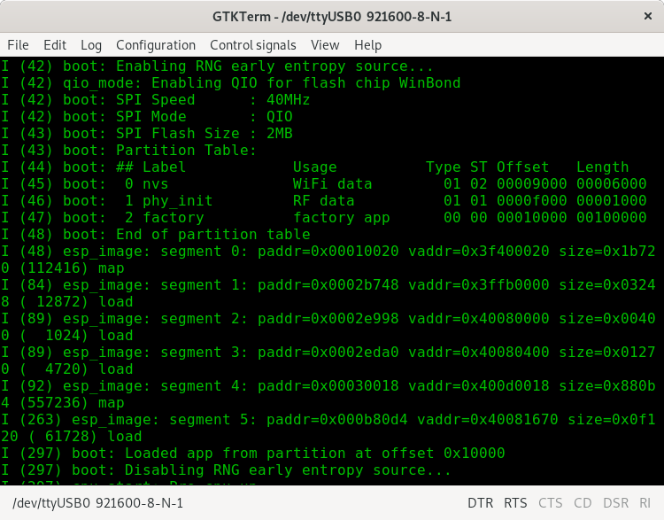

# GTKTerm: A GTK+ Serial Port Terminal

GTKTerm is a simple, graphical serial port terminal emulator for Linux and possibly other POSIX-compliant operating systems. It can be used to communicate with all kinds of devices with a serial interface, such as embedded computers, microcontrollers, modems, GPS receivers, CNC machines and more.

    

## Usage
### Keyboard Shortcuts 
As GTKTerm is often used like a terminal emulator,
the shortcut keys are assigned to `<ctrl><shift>`, rather than just `<ctrl>`. This allows the user to send keystrokes of the form `<ctrl>X` and not have GTKTerm intercept them.

Key Combination | Effect
---:|---
`<ctrl><shift>L` | Clear screen
`<ctrl><shift>R` | Send file
`<ctrl><shift>Q` | Quit 
`<ctrl><shift>S` | Configure port
`<ctrl><shift>V` | Paste
`<ctrl><shift>C` | Copy
`<ctrl>B` | Send break
F5 | Open Port
F6 | Close Port
F7 | Toggle DTR
F8 | Toggle RTS

### Command Line Options
See `man gtkterm` or `gtkterm --help` for more information on available command line interface options.

### Notes on RS485:
The RS485 flow control is a software user-space emulation and therefore may not work for all configurations (won't respond quickly enough). If this is the case for your setup, you will need to either use a dedicated RS232 to RS485 converter, or look for a kernel level driver. This is an inherent limitation to user space programs.

### Scriptability with Signals
Some microcontrollers and other embedded devices are flashed using the same serial interface that is also used for outputting debug information. To facilitate rapid development on these platforms, GTKTerm supports the following UNIX signals:

Signal | Action | Usage Example
---:|:---:|---
`SIGUSR1` | Open Port | `killall -USR1 gtkterm`
`SIGUSR2` | Close Port | `killall -USR2 gtkterm`

You may find it useful to send these signals in your own firmware flashing scripts.

## Installation
GTKTerm has a few dependencies-
* Gtk+3.0 (version 3.12 or higher)
* vte (version 0.40 or higher)
* intltool (version 0.40.0 or higher)
* libgudev (version 229 or higher)

Once these dependencies are installed, most people should simply run:

	meson build
	ninja -C build

To install GTKTerm system-wide, run:

	ninja -C build install
	gtk-update-icon-cache

If you wish to install GTKTerm someplace other than the default directory, e.g. in `/usr`, use:

	meson build -Dprefix=/usr

Then build and install as usual.

## License
Original Code by: Julien Schmitt

    This program is free software: you can redistribute it and/or modify
    it under the terms of the GNU General Public License as published by
    the Free Software Foundation, either version 3 of the License, or
    (at your option) any later version.

    This program is distributed in the hope that it will be useful,
    but WITHOUT ANY WARRANTY; without even the implied warranty of
    MERCHANTABILITY or FITNESS FOR A PARTICULAR PURPOSE.  See the
    GNU General Public License for more details.

    You should have received a copy of the GNU General Public License
    along with this program.  If not, see <http://www.gnu.org/licenses/>.
