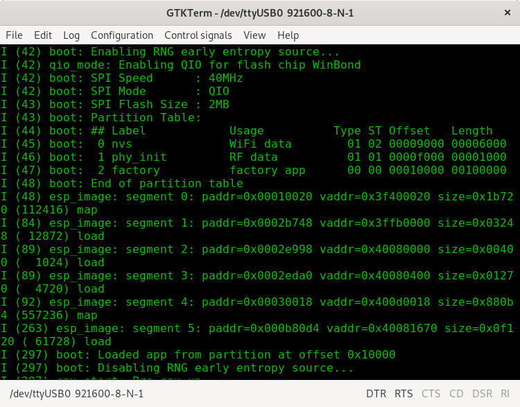

# GTKTerm: A GTK+ Serial Port Terminal

GTKTerm is a simple, graphical serial port terminal emulator for Linux and possibly other POSIX-compliant operating systems. It can be used to communicate with all kinds of devices with a serial interface, such as embedded computers, microcontrollers, modems, GPS receivers, CNC machines and more.

    

## Usage
### Keyboard Shortcuts 
As GTKTerm is often used like a terminal emulator,
the shortcut keys are assigned to `<ctrl><shift>`, rather than just `<ctrl>`. This allows the user to send keystrokes of the form `<ctrl>X` and not have GTKTerm intercept them.

Key Combination | Effect
---:|---
`<ctrl><shift>L` | Clear screen
`<ctrl><shift>R` | Send file
`<ctrl><shift>Q` | Quit
`<ctrl><shift>S` | Configure port
`<ctrl><shift>V` | Paste
`<ctrl><shift>C` | Copy
`<ctrl><shift>F` | Find
`<ctrl><shift>K` | Clear Scrollback
`<ctrl><shift>A` | Select All
`<ctrl><shift>B` | Send Break
`<ctrl>B` | Send break
F5 | Open Port
F6 | Close Port
F7 | Toggle DTR
F8 | Toggle RTS

### Command Line Options
See `man gtkterm` or `gtkterm --help` for more information on available command line interface options.

### Notes on RS485:
The RS485 flow control is a software user-space emulation and therefore may not work for all configurations (won't respond quickly enough). If this is the case for your setup, you will need to either use a dedicated RS232 to RS485 converter, or look for a kernel level driver. This is an inherent limitation to user space programs.

### Scriptability with Signals
Some microcontrollers and other embedded devices are flashed using the same serial interface that is also used for outputting debug information. To facilitate rapid development on these platforms, GTKTerm supports the following UNIX signals:

Signal | Action | Usage Example
---:|:---:|---
`SIGUSR1` | Open Port | `killall -USR1 gtkterm`
`SIGUSR2` | Close Port | `killall -USR2 gtkterm`

You may find it useful to send these signals in your own firmware flashing scripts.

## Installation
GTKTerm has a few dependencies-
* Gtk+3.0 (version 3.12 or higher)
* vte (version 0.40 or higher)
* intltool (version 0.40.0 or higher)
* libgudev (version 229 or higher)

Once these dependencies are installed, most people should simply run:

	meson build
	ninja -C build

For development-focused memory diagnostics, you can build with sanitizers enabled:

    meson setup build-asan -Ddev_sanitizers=true
    ninja -C build-asan

For Valgrind runs in this repository, use the included suppression file to filter common GTK/fontconfig/NVIDIA noise:

    valgrind --suppressions=asan_suppressions.txt --leak-check=full build/src/gtkterm

For actual leak detection on a normal GUI startup/shutdown path, prefer the helper script instead of a raw timeout-based run. It starts Xvfb, applies a lower-noise GTK/GLib runtime environment, and exits the app cleanly over D-Bus:

	tools/leak-check.sh --valgrind
	tools/leak-check.sh --asan --build-dir build-asan

This is a better signal for app-owned leaks than `gtkterm --help`, because it exercises the GUI lifecycle and avoids forced termination.

To install GTKTerm system-wide, run:

	ninja -C build install
	gtk-update-icon-cache

If you wish to install GTKTerm someplace other than the default directory, e.g. in `/usr`, use:

	meson build -Dprefix=/usr

Then build and install as usual.

### Building A Debian Package
If you have `dpkg-buildpackage` installed, build a Debian package via the Meson packaging target:

    ninja -C builddir deb

To pass additional arguments to `dpkg-buildpackage`, run the helper directly:

    bash packaging/scripts/build-deb.sh -S

The Debian metadata is stored in `packaging/debian`.

### Building A Snap Package
If you have `snapcraft` installed, build a local Snap package via the Meson packaging target:

    ninja -C builddir snap

By default, the helper uses `--destructive-mode` for local builds.
To use an LXD/Multipass provider instead, run the helper directly:

    bash packaging/scripts/build-snap.sh --use-lxd

The resulting `.snap` file is written to the repository root.
The Snap manifest is stored in `packaging/snap/snapcraft.yaml`.

### Building A Flatpak Bundle
If you have `flatpak` and `flatpak-builder` installed, build a local Flatpak bundle via the Meson packaging target:

    ninja -C builddir flatpak

To pass additional arguments to `flatpak-builder`, run the helper directly:

    bash packaging/scripts/build-flatpak.sh --disable-rofiles-fuse

The resulting bundle is written to `gtkterm.flatpak` in the repository root.
The Flatpak manifest is stored in `packaging/flatpak/org.gtk.gtkterm.json`.

### Building An AppImage
If you have `linuxdeploy` and `appimagetool` installed, build an AppImage via the Meson packaging target:

    ninja -C builddir appimage

To select a different build directory or output path, run the helper directly:

    bash packaging/scripts/build-appimage.sh --build-dir builddir --output gtkterm-x86_64.AppImage

The resulting AppImage is written to the repository root by default.

### Building An RPM Package
If you have `rpmbuild` installed, build RPM packages via the Meson packaging target:

    ninja -C builddir rpm

To pass additional arguments to `rpmbuild`, run the helper directly:

    bash packaging/scripts/build-rpm.sh --nocheck

The RPM spec is stored in `packaging/rpm/gtkterm.spec`.

### Running In A Docker Container (Ubuntu 24.04)

A Docker image is provided for testing on Ubuntu 24.04 (glibc 2.39, no `cfsetobaud`),
which exercises the kernel `termios2`/`BOTHER` fallback baud-rate path.

**Build the image:**

    docker build -f packaging/docker/ubuntu2404.Dockerfile -t gtkterm:ubuntu2404 .

**Run the GUI on your host Wayland session:**

    packaging/docker/run-wayland.sh

The script forwards the host Wayland socket into the container and uses GTK4's
software renderer, so no GPU drivers are needed inside the image.

**With a serial device:**

    SERIAL_DEVICE=/dev/ttyUSB0 packaging/docker/run-wayland.sh -p /dev/ttyUSB0 -s 115200

The script maps the device into the container and adds its group (e.g. `dialout`)
so the non-root container process can access it.  If you lack permission on the
host, a clear error is printed with the `usermod` command needed to fix it:

    run-wayland.sh: no permission to access '/dev/ttyUSB0'
        (owned by root:dialout, mode 660; you are alice)
        Add yourself to the 'dialout' group, then log out and back in:
            sudo usermod -aG dialout alice

## Uninstallation
To uninstall GTKTerm, run:

	ninja -C build uninstall

If you already deleted the `build` directory, just compile and install GTKTerm again as explained in the [previous section](#installation) with the same target location prefix (`-Dprefix`) and perform the uninstall step afterwards.

## License
Original Code by: Julien Schmitt

    This program is free software: you can redistribute it and/or modify
    it under the terms of the GNU General Public License as published by
    the Free Software Foundation, either version 3 of the License, or
    (at your option) any later version.

    This program is distributed in the hope that it will be useful,
    but WITHOUT ANY WARRANTY; without even the implied warranty of
    MERCHANTABILITY or FITNESS FOR A PARTICULAR PURPOSE.  See the
    GNU General Public License for more details.

    You should have received a copy of the GNU General Public License
    along with this program.  If not, see <http://www.gnu.org/licenses/>.
